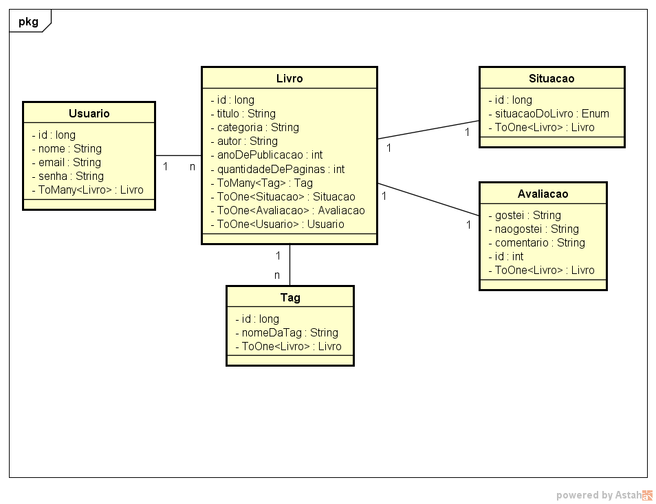

# Bookmark_AppLivro
Aplicativo de acompanhamento de leituras  
Disciplina: POO  
Professor: Rogério Silva  
ADS - IFPI

## Funcionalidades
- Organizar os livros em estados de:
  - Lendo
  - Lido
  - Deseja Ler

- Cadastrar Livros
  - Título
  - Categoria
  - Autor
  - Ano de Publicação
  - Quantidade de Páginas
  - Tags (obrigatoriamente 03)

- Biblioteca
  - Lista de livros desejados
  - Passar os livros que desejar ler para o estado de lendo e por fim lidos

- Registrar progresso da leitura
- Receber a página atual
- Utilizar barra de progresso

- Informar data inicial e final da leitura

- Avaliação objetiva do livro
  - Gostei
  - Não gostei
  - Comentário

- Registrar tópicos do livro
  - Capítulos
  - Pequeno resumo de cada capítulo
  
## Diagrama

## Telas
"
